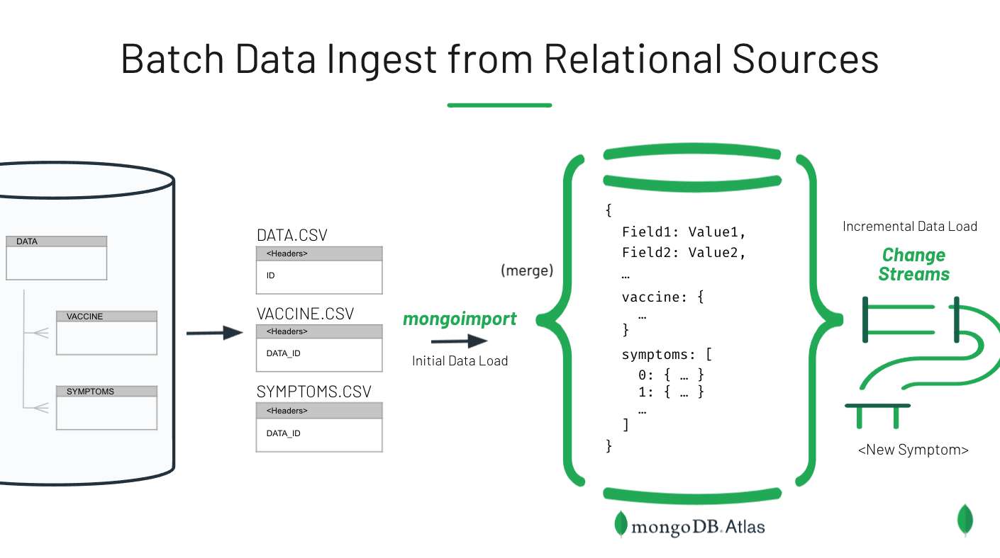

# Loading Relational Data into MongoDB

Like JSON, CSV files can also be loaded directly into MongoDB, without needing to define any schema in advance. A document will be created for each row in the CSV file, and the headerline in the CSV file is used to define the document attributes.

Oftentimes, however, data that arrives in CSV format comes as a collection of files rather than just one. This set of files can represent a database dump generated from a relational database. As such, the different files may correspond to master and detail records, where there exists a one-to-one or one-to-many relationship between the two. When bringing this data into MongoDB, you'll want to adjust your approach  to take advantage of the JSON data model. Detail records that have a one-to-one relationship with the master record can be represented as a subdocument. Those that have a one-to-many relationship can be represented as an embedded array. These merge operations can be handled by mongoimport, through the use of relevant settings and the application of a specific naming convention to the CSV headlines.

This data comes from VAERS (Vaccine Adverse Event Reporting System), accessible [here](https://vaers.hhs.gov/data/datasets.html?), and includes the main data file and two related files for symptoms and vaccine information. Data from these 3 files can be merged into a single document using mongoimport, which supports both nested data and embedded arrays (using certain naming conventions in the CSV header line). The vaccine data is loaded as a subdocument, and the symptoms are loaded as an embedded array of documents. Note that assumptions are being made here for illustrative purposes - the vaccine data is assumed to be a 1-to-1 relationship while the symptoms are assumed to be 1-to-Many.

