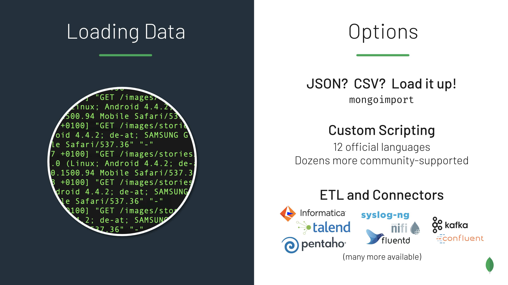

# Loading Data into MongoDB

Use these data sets and scripts to demonstrate the various ways to load data into MongoDB. 
- JSON: A Zeus (malware) data set (uses mongoimport)
- CSV: A network data set from Kaggle (mongoimport)
- Log Files: An Apache log file (loaded via Python script)
- RDBMS: A basic data dump (3 tables, 3 CSV files) from a relational model (mongoimport)
- XML: Convert to JSON and load into MongoDB

