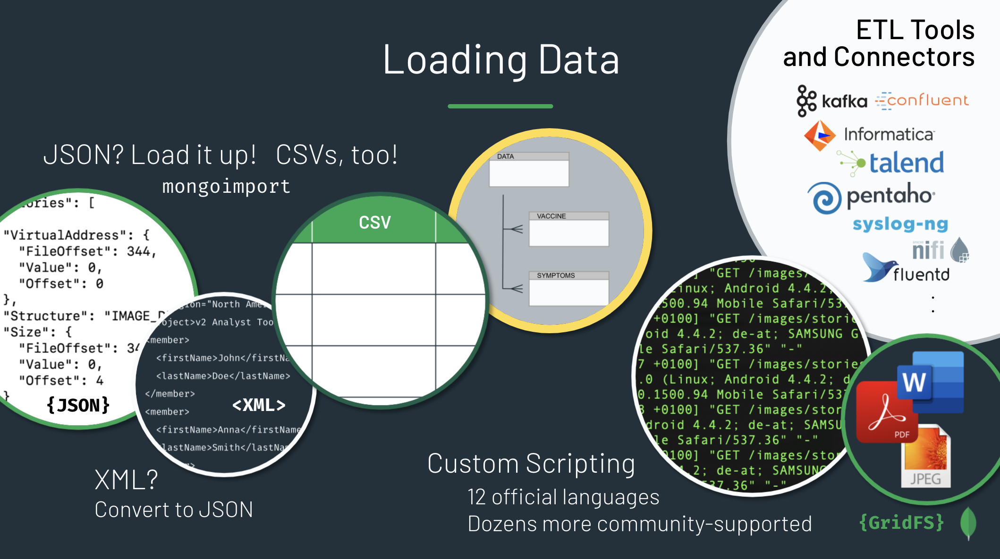

# Loading Data into MongoDB

Scripts, code, and data sets to load various types of data into MongoDB.

- JSON: Import with *mongoimport*. A malware/cybersecurity data set (Zeus).
- XML: Convert to JSON and import with *mongoimport*. Data from the OME (Open Microscopy Environment).
- CSV: Import via *mongoimport*, remodeling relational data as JSON in the process. Data from VAERS (Vaccine Adverse Event Reporting System).
- Log Files: Use the MongoDB Python Driver to parse and load apache log files into MongoDB. 
- Binary Files: Leverage the GridFS API in MongoDB to upload and download large files to and from MongoDB. Includes a Java client as well as a handful of commands to use with *mongofiles* (a command-line tool).

